# 📜 Awesome Data Contracts Platform 🚀

  
  
  
  
  

## 🌟 Top Data Contracts Platforms Ecosystem
**Curated List of SaaS Products & Open-Source GitHub Projects**  
*Focused on Schema Agreements, Quality SLAs, Producer–Consumer Contracts, Stream/API Contracts & Enforceable Data Promises.*

---

## 📌 Table of Contents
- [📖 Overview & SEO Guide](#-overview--seo-guide)
- [🏢 Commercial & SaaS Platforms](#-commercial--saas-platforms)
- [🔓 Open-Source GitHub Projects](#-open-source-github-projects)
- [💡 Custom Contract Architectures](#-custom-contract-architectures)
- [🤝 How to Contribute](#-how-to-contribute)
- [❤️ Support & Community](#-support--community)
- [📈 Star History](#-star-history)
- [⚖️ Disclaimer](#-disclaimer)

---

## 📖 Overview & SEO Guide

**Data Contracts** formalize interface agreements between **data producers** and **data consumers**. They define:
1. **Schema & Semantics**: Column types, names, nullability, breaking change rules, semantic field tags.
2. **Quality & Test SLAs**: Freshness thresholds, null rates, range bounds, anomaly checks.
3. **Producer–Consumer Governance**: Ownership, operational SLAs, breaking change notifications, and lineage-aware dependency tracking.
4. **Stream & API Enforcement**: Compatibility checks on message streams (Kafka/Pulsar) and REST/Event APIs.

By enforcing data contracts early in CI/CD pipelines and ingestion layers, data engineering teams eliminate downstream pipeline breakages and ensure high-reliability data architecture.

---

## 🏢 Commercial & SaaS Platforms

📊 **Market Overview**: The Data Governance, Quality, and Observability market is estimated at **$7.5B - $10B** in 2026 (growing at ~21% CAGR). The sector is **moderately fragmented**, featuring high-valuation streaming and observability platforms alongside specialized catalog and contract management vendors.

Below is a curated tabular breakdown of leading commercial SaaS platforms supporting data contracts, sorted by **Company Size / Valuation** (descending):

| Platform / SaaS 🌐 | Company Size / Valuation 💰 | Starting Price 💵 | Free Tier / Trial Limits 🎁 | Key Features & Contract Capabilities 🛠️ |
| :--- | :--- | :--- | :--- | :--- |
| **[Confluent Stream Governance](https://www.confluent.io/)** | ~$8.5B Market Cap (Public: CFLT) | $0.10/GB processed ($0/mo min) | $400 free cloud credits valid for 30 days | Kafka Schema Registry, Protobuf/Avro schema evolution, stream data contract rules. |
| **[Monte Carlo](https://www.montecarlodata.com/)** | ~$1.6B Valuation (Series D) | $1,250/mo ($15,000/yr starter) | 14-day free trial with full warehouse connectivity | Data observability, lineage-aware contract alerts, freshness & schema drift detection. |
| **[Atlan](https://atlan.com/)** | ~$750M Valuation (Series C) | $2,000/mo ($24,000/yr starter) | 14-day guided proof-of-concept trial | Active metadata catalog, data asset governance, producer-consumer ownership mapping. |
| **[Redpanda Cloud](https://www.redpanda.com/)** | ~$300M Valuation (Series C) | $0.20/GB ($10/mo min serverless) | $300 free cloud credits valid for 30 days | High-performance streaming platform with built-in topic schema validation and governance. |
| **[Acryl Data (DataHub Cloud)](https://datahubproject.io/)** | ~$150M Valuation (Series A) | $500/mo (Developer plan) | 14-day free trial (up to 5 active users) | Managed DataHub catalog, assertions, contract enforcement, and lineage tracking. |
| **[Soda Cloud](https://www.soda.io/)** | ~$60M Valuation (Series A) | $300/mo (Starter plan) | 30-day free trial with unlimited quality scans | Data quality agreements as code, contract violation reporting, and anomaly detection. |
| **[Datafold](https://www.datafold.com/)** | ~$50M Valuation (Series A) | $400/mo (Developer plan) | 14-day free trial (5 users & 100 diff executions) | CI/CD data diffing, regression prevention, pre-promotion contract validation. |
| **[Secoda](https://www.secoda.co/)** | ~$40M Valuation (Series A) | $199/mo (Starter plan) | 14-day free trial (all features unlocked) | AI-assisted data catalog, documentation governance, dictionary-based agreements. |
| **[Metaplane](https://www.metaplane.dev/)** | ~$35M Valuation (Series A) | $240/mo ($0 starter tier) | 14-day free trial + forever free tier for up to 10 tables | Warehouse monitoring, automated anomaly alerts, quality SLA reporting. |
| **[Collate (OpenMetadata Cloud)](https://open-metadata.org/)** | ~$30M Valuation (Seed) | $250/mo (Business plan) | 30-day free trial (up to 5 user seats) | Native end-to-end data contracts (schema, SLA, semantics) with open-source foundation. |
| **[Elementary Cloud](https://www.elementary-data.com/)** | ~$25M Valuation (Seed) | $200/mo (Starter Cloud) | 30-day free trial with dbt Core integration | dbt-native data observability, transformation testing, and contract monitoring. |
| **[Sifflet](https://www.siffletdata.com/)** | ~$20M Valuation (Series A) | $500/mo (Essentials plan) | 14-day free trial with full feature suite | Full-stack observability platform for warehouse, pipeline, and contract SLAs. |
| **[AsyncAPI Studio](https://www.asyncapi.com/)** | Community / Non-Profit (Linux Foundation) | $0/mo (100% Free Open Tooling) | Unlimited free access forever | Event-driven API schema design, contract visualization, and code generation. |

---

## 🔓 Open-Source GitHub Projects

Data contracts have rich open-source foundations. Below are top open-source projects sorted by **GitHub Stars_Count** (descending), featuring social Stars_Badges linking directly to each repository's stargazers page:

1. **[OpenMetadata](https://github.com/open-metadata/OpenMetadata)**   
   *All-in-one open-source data catalog & governance platform with native data contract definitions (schema, SLA, semantics) and interactive UI.*

2. **[Bytebase](https://github.com/bytebase/bytebase)**   
   *Database DevOps & schema migration management platform with enforced SQL review policies and data change contracts.*

3. **[DataHub](https://github.com/datahub-project/datahub)**   
   *Extensible metadata platform supporting real-time assertions, schema evolution rules, and producer-consumer governance.*

4. **[Great Expectations](https://github.com/great-expectations/great_expectations)**   
   *Python validation framework for specifying data expectations as enforceable contracts during pipeline execution.*

5. **[dlt (Data Load Tool)](https://github.com/dlt-hub/dlt)**   
   *Python-first data loading library with automatic schema inference, evolution policies, and structural contract guards.*

6. **[Amundsen](https://github.com/amundsen-io/amundsen)**   
   *Data discovery and metadata engine created to track asset ownership, schema definitions, and usage context.*

7. **[Schemathesis](https://github.com/schemathesis/schemathesis)**   
   *Property-based contract testing tool for OpenAPI and GraphQL specifications.*

8. **[OpenLineage](https://github.com/OpenLineage/OpenLineage)**   
   *Open framework for collecting data lineage to trace contract dependencies between upstream producers and downstream consumers.*

9. **[Confluent Schema Registry](https://github.com/confluentinc/schema-registry)**   
   *Centralized schema repository providing compatibility checks for Apache Kafka message contracts (Avro, Protobuf, JSON Schema).*

10. **[Soda Core](https://github.com/sodadata/soda-core)**   
    *CLI and Python library to express data quality contracts as YAML and execute checks in CI/CD or orchestration pipelines.*

11. **[Elementary](https://github.com/elementary-data/elementary)**   
    *dbt-native observability framework for validating models, checking schemas, and enforcing dbt data contracts.*

12. **[Marquez](https://github.com/marquezproject/marquez)**   
    *OpenLineage reference implementation for collecting, storing, and visualizing dataset metadata and contract lineage.*

13. **[Data Contract CLI](https://github.com/datacontract/cli)**   
    *Open-source CLI tool to lint, test, and enforce YAML-based Data Contract Specification files against databases and warehouses.*

---

## 💡 Custom Contract Architectures

A modern open-source Data Contract pipeline setup typically combines:
- **Contract Specs**: Define YAML/JSON contracts via [Data Contract CLI](https://github.com/datacontract/cli) or OpenMetadata.
- **Pipeline Testing**: Enforce checks in CI/CD using [Soda Core](https://github.com/sodadata/soda-core), [Great Expectations](https://github.com/great-expectations/great_expectations), or [Elementary](https://github.com/elementary-data/elementary).
- **Streaming Contracts**: Enforce Kafka schema rules with [Schema Registry](https://github.com/confluentinc/schema-registry).
- **Lineage Tracking**: Monitor producer-consumer dependencies via [OpenLineage](https://github.com/OpenLineage/OpenLineage).

---

## 🤝 How to Contribute

Contributions are warmly welcomed! 💖
1. **Fork** the repository.
2. Add or update entries in `README.md` following the tabular or badged structure.
3. Ensure links, pricing, free tier limits, and Stars_Counts are accurate.
4. Submit a **Pull Request** with a clear explanation of changes.

For curated lists guidelines, see [Awesome Lists](https://github.com/ishandutta2007/Awesome-Awesome-Awesome).

---

## ❤️ Support & Community

Thank you for visiting and supporting the **Awesome Data Contracts Platform** ecosystem! 🌟  
If you find this repository helpful, please consider:
- ⭐️ **Starring** this repo to help others discover it.
- 🔀 **Forking** it to customize or contribute new data governance tools.
- 📢 **Sharing** it with data engineers, analytics leads, and data architects.

☕ **Sponsor & Support**:  
If you'd like to support open-source data engineering curation:  

---

## 📈 Star History

---

## ⚖️ Disclaimer

- This is a **community-curated** repository provided for educational and informational purposes.
- Data contracts reduce pipeline breakages but must be coupled with organizational governance and testing.
- Platform pricing and features change over time; refer to official vendor documentation for up-to-date details.
